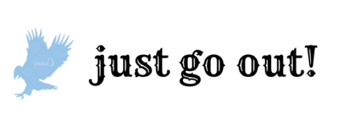

        <main>
            <header class="banner">
Strefa dla osób aktywnych
</header>
            

                

            

                

                

                

                    
Login: <input type="text" placeholder="insert user name" name="uname" required>

                    
Hasło: <input type="password" placeholder="insert password" name="upass" required>

                    <button title="Login">Zaloguj</button>
                    <a>Wciąż nie masz konta? <a href="#">Zarejestruj się!</a></a>
                

            <article class="content">
                <header>
                    <h1>Lorem ipsum dolor sit amet consectetur adipisicing elit.</h1>
                    </header>
                        

                            
Lorem ipsum, dolor sit amet consectetur adipisicing elit. Amet provident a cupiditate reprehenderit quod sint pariatur omnis aliquam eum, doloremque animi repudiandae iusto dicta enim laboriosam autem ab iste. Dicta.

                            
Lorem ipsum dolor sit amet consectetur, adipisicing elit. Asperiores odit beatae maxime similique quae deleniti unde ex consequatur explicabo minus sed, quod, ducimus pariatur dolorem eum in tempora eveniet veritatis.
                            Saepe velit nihil explicabo quo. Nulla maxime doloremque dicta et dolore corrupti ipsum aut ratione eligendi quia blanditiis saepe quam ex consequatur exercitationem optio commodi adipisci, ipsa placeat fuga illum.
                            Assumenda reiciendis laborum perspiciatis similique distinctio quas earum, nemo labore voluptates eveniet vero soluta, itaque alias obcaecati pariatur, veritatis quasi reprehenderit fuga incidunt voluptas dignissimos! A laboriosam maiores vitae eaque.
                            Consectetur voluptate reiciendis beatae aspernatur perferendis, iusto autem deserunt, accusantium quisquam molestiae facilis atque dolore aliquid minus, quasi eaque accusamus nesciunt ex tempora dolor quod modi eveniet voluptas. Laborum, officia.
                            Sapiente reprehenderit consequatur omnis architecto cum, corrupti fuga praesentium iste ab quaerat ex iure tempora amet aspernatur quo. Optio sapiente, quisquam aperiam suscipit nisi vel et totam explicabo velit corporis?
                            Nihil porro officiis aliquam pariatur ipsum doloremque aliquid veritatis est animi nostrum ad non cupiditate tempore temporibus laboriosam, ipsa molestiae illo ducimus nobis molestias expedita! Facilis reprehenderit quibusdam harum nisi.
                            Impedit ipsa explicabo quos voluptatibus fugiat nihil iste esse. Impedit alias eveniet est autem magni, dolores temporibus nemo hic labore porro dolorum ipsum quae ad quos enim odit nostrum dolorem!
                            Praesentium alias dicta iste voluptates esse vero ipsum quas cum, nam sit at aliquid deleniti repellendus fuga ad recusandae hic iusto blanditiis dolorum, nemo optio a eaque nisi ab. Obcaecati?

                            
Lorem ipsum, dolor sit amet consectetur adipisicing elit. Amet provident a cupiditate reprehenderit quod sint pariatur omnis aliquam eum, doloremque animi repudiandae iusto dicta enim laboriosam autem ab iste. Dicta.

                            <time datetime="2020-05-05T11:20:00"><small>2021-01-11 14:05</small></time>
                        

            </article>

            <nav class="navbar">
                

                    <h6>Menu nawigacyjne</h6>

                    <ul>
                     <li class="sublink">
                            <a href="#">link1

                             <ul class="submenu">
                                    <li>Link1</li>
                                </ul>
                            </a>
                        </li>
                        <li class="sublink">
                            <a href="#">link2

                             <ul class="submenu">
                                    <li>Link1</li>
                                </ul>
                            </a>
                     </li>
                     <li class="sublink">
                         <a href="#">link3

                             <ul class="submenu">
                                    <li>Link1</li>
                                </ul>
                            </a>
                        </li>
                    </ul>
                

            </nav>

            <footer class="footer">
                
Masz sugestie odnośnie działania serwisu? Napisz do mnie 

            </footer>
        </main>

        
